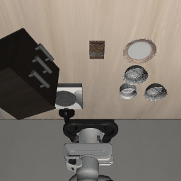

# SmolVLA action-head comparison: flow vs. regression vs. diffusion

A controlled comparison of three action-generation objectives for a Vision-Language-Action policy
([SmolVLA](https://huggingface.co/lerobot/smolvla_base)) on the LIBERO manipulation benchmark. The
backbone, the conditioning, the ~100M action **expert**, the data, and the training recipe are all
held fixed and **only the objective varies** (flow matching, L1 regression, DDPM diffusion) so any
gap in success is attributable to the objective, not the architecture.

**📝 Full writeup (theory, figures, and the debugging story):**
[jamessteiner.github.io/projects/vla-action-heads](https://jamessteiner.github.io/projects/vla-action-heads/)

<p align="center">
  <br>
  <sub><i>A trained policy (flow head) on a LIBERO-Spatial pick-and-place.</i></sub>
</p>

## Result

LIBERO-Spatial, 10 tasks × 8 rollouts = 80 episodes per head (best checkpoint of each):

| objective | success ± SE | inference latency | action smoothness ↓ | train steps |
|---|---|---|---|---|
| flow matching | 73.8% ± 4.9 | 615 ms / chunk | 0.162 | 30k |
| L1 regression | 70.0% ± 5.1 | **286 ms / chunk** | **0.103** | 30k |
| DDPM diffusion | 38.8% ± 5.4 | 618 ms / chunk | 0.249 | 60k |

Regression ties flow matching at ~2× lower latency, and both beat DDPM diffusion even though
diffusion was given 2× the training budget. The [writeup](https://jamessteiner.github.io/projects/vla-action-heads/)
covers why, and the error-bar caveats behind the ranking.

<sub>Latency = mean ms/chunk on Apple-Silicon MPS (device-relative; read the ratio). Smoothness =
mean ‖aₜ₊₁ − aₜ‖ over a rollout, lower is smoother.</sub>

## Method

All three objectives reuse SmolVLA's action expert, the transformer that cross-attends to the frozen
VLM prefix, and its `action_out_proj`; only the loss and the sampler differ. They live in
[`src/vla/heads/expert_objectives.py`](src/vla/heads/expert_objectives.py):

- **Flow.** LeRobot's native `SmolVLAPolicy.forward` (predict a velocity field, integrate the ODE).
- **Regression.** deterministic forward (zero query, `t=0`) + masked L1.
- **Diffusion.** DDPM training / DDIM sampling (predict ε), caching the prefix KV so DDIM inference
  stays as cheap as flow.

The VLM backbone is frozen (`train_expert_only`); only the expert + its IO projections train, using
SmolVLA's own optimizer and LR schedule (AdamW, warmup → cosine decay), identical across the three
runs. Evaluation is closed-loop rollouts in the LIBERO simulator, scored on success (with a binomial
standard error), inference latency, and action smoothness.

## Reproduce

**Evaluate** runs on macOS; the harness routes around LIBERO's Linux-only deps:

```bash
uv sync
bash scripts/setup_libero_macos.sh        # one-time: robosuite + MuJoCo + LIBERO assets

uv run python scripts/phase0_gate.py --head flow \
  --checkpoint james-steiner/smolvla-libero-flow-v3 --subfolder step_30000 \
  --stats-dataset lerobot/libero --tasks 10 --trials 8
# regression: --checkpoint james-steiner/smolvla-libero-regression   --subfolder step_30000 --head regression
# diffusion:  --checkpoint james-steiner/smolvla-libero-diffusion-v2 --subfolder final      --head diffusion
```

**Train** needs a CUDA GPU; one config per head:

```bash
# fresh cloud pod: clone, install, verify CUDA, launch under nohup, auto-push checkpoints to the Hub
export WANDB_API_KEY=... HF_TOKEN=... CONFIG=configs/flow.yaml HUB_REPO=<you>/smolvla-libero-flow
git clone https://github.com/JamesSteiner/vla.git && bash vla/scripts/bootstrap_cloud.sh
# or directly:  uv run python scripts/train.py --config configs/regression.yaml --hub-repo <you>/...
```

## Repo layout

```
src/vla/
  heads/expert_objectives.py  — the 3 objectives on the shared expert (loss + sampler)
  policy/smolvla_wrapper.py   — SmolVLA preprocessor/postprocessor for the dataset's norm stats
  data/libero.py              — lerobot/libero → action-chunked batches + episode train/val split
  eval/metrics.py             — latency timer, action smoothness
scripts/
  train.py                    — one training loop; objective selected by --config
  phase0_gate.py              — LIBERO sim rollout eval (success ± SE / latency / smoothness)
  bootstrap_cloud.sh          — one-command cloud training
  setup_libero_macos.sh       — macOS LIBERO sim setup
configs/                      — base + flow / regression / diffusion
```

## Notes

Single suite (LIBERO-Spatial) and a single seed, so the error bars are within-run and latency is
MPS-relative — this is a controlled comparison of objectives on a fixed expert, not a leaderboard
entry. Built on [SmolVLA](https://huggingface.co/lerobot/smolvla_base) (LeRobot) and the
[LIBERO](https://libero-project.github.io/) benchmark.

## License

MIT. See [LICENSE](LICENSE).
